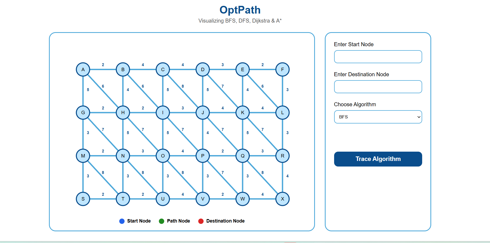
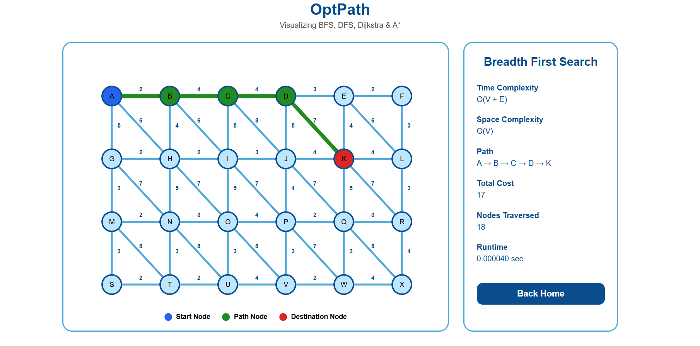
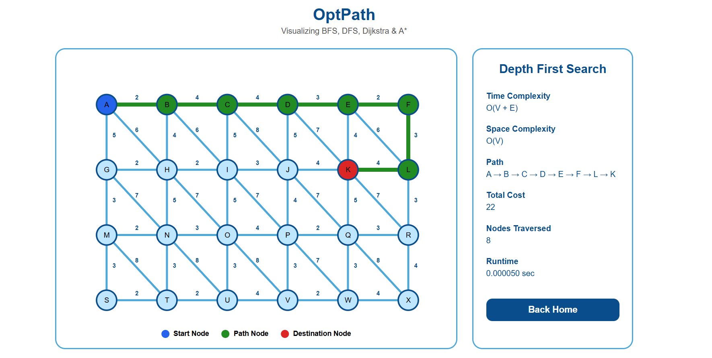
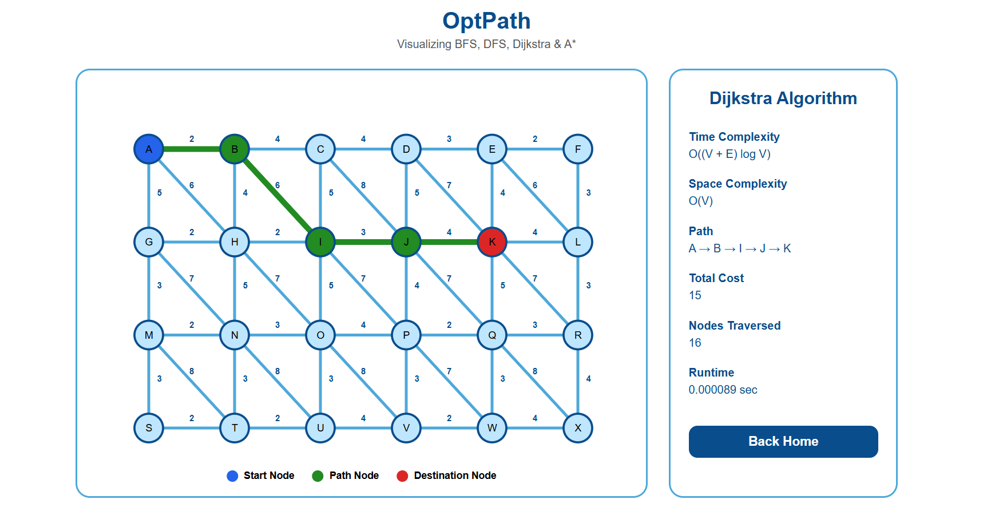
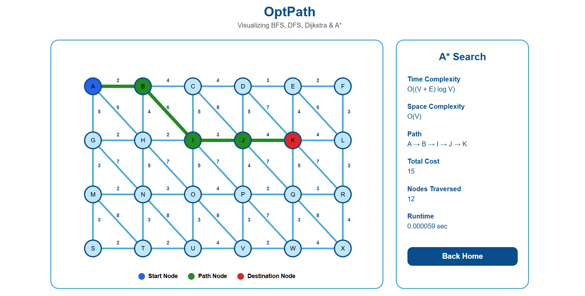

# OptPath

### Interactive Optimal Path Visualizer

OptPath is a fullstack web application that visualizes and compares classical graph traversal and shortest path algorithms on a weighted graph network. Users can select source and destination nodes, choose a pathfinding algorithm, and observe the computed route through graph animations and corresponding metrics.

**Live Demo:** https://optpath.onrender.com

**GitHub Repository:** https://github.com/k-o-c-o/OptPath

---

## Overview

OptPath was developed to demonstrate the behavior and performance of commonly used graph traversal and pathfinding algorithms. The application provides an interactive environment where users can visualize route computation, compare algorithm outputs, and analyze traversal statistics.

---

## Features

* Interactive weighted graph visualization
* Realtime path tracing animation
* Weighted edge representation
* Dynamic graph highlighting
* Runtime measurement
* Total path cost calculation
* Nodes traversed analysis
* Time and space complexity display

---

## Algorithms Implemented

| Algorithm                  | Purpose                                         | Time Complexity  | Space Complexity |
| -------------------------- | ----------------------------------------------- | ---------------- | ---------------- |
| Breadth First Search (BFS) | Finds shortest path in terms of number of edges | O(V + E)         | O(V)             |
| Depth First Search (DFS)   | Explores graph depth first before backtracking  | O(V + E)         | O(V)             |
| Dijkstra's Algorithm       | Finds minimum cost path in a weighted graph     | O((V + E) log V) | O(V)             |
| A* Search                  | Heuristic guided shortest path search           | O((V + E) log V) | O(V)             |

---

## Tech Stack

### Frontend

* HTML5
* CSS3
* JavaScript
* SVG Graphics

### Backend

* Node.js
* Express.js

### Tools & Deployment

* Git
* GitHub
* Render

---

## Project Structure

```text
OptPath/
│
├── backend/
│   ├── algorithms/
│   │   ├── astar.js
│   │   ├── bfs.js
│   │   ├── dfs.js
│   │   └── dijkstra.js
│   │
│   ├── generateGraph.js
│   ├── graph.js
│   ├── package.json
│   ├── package-lock.json
│   └── server.js
│
├── frontend/
│   ├── index.html
│   ├── script.js
│   └── style.css
│
├── .gitignore
└── README.md
```

## Key Metrics

- 24 node weighted graph network
- 57 weighted edges including diagonal connections
- 4 pathfinding algorithms implemented
- Path visualization and performance analysis

---

## Screenshots

### Home Interface


### BFS Visualization


### DFS Visualization


### Dijkstra Visualization


### A* Visualization


---

## Installation

Clone the repository:

```bash
git clone https://github.com/k-o-c-o/OptPath.git
```

Navigate to the backend directory:

```bash
cd OptPath/backend
```

Install dependencies:

```bash
npm install
```

Start the server:

```bash
npm start
```

Open the application in your browser:

```text
http://localhost:5000
```

---


## Future Enhancements

* Random maze generation
* Bellman-Ford Algorithm
* Floyd-Warshall Algorithm
* Priority queue optimization for improved scalability on larger graph datasets


---

## Author

**Naina Edwin**

B.Tech in Computer and Communication Engineering
Manipal Institute of Technology

GitHub: https://github.com/k-o-c-o
